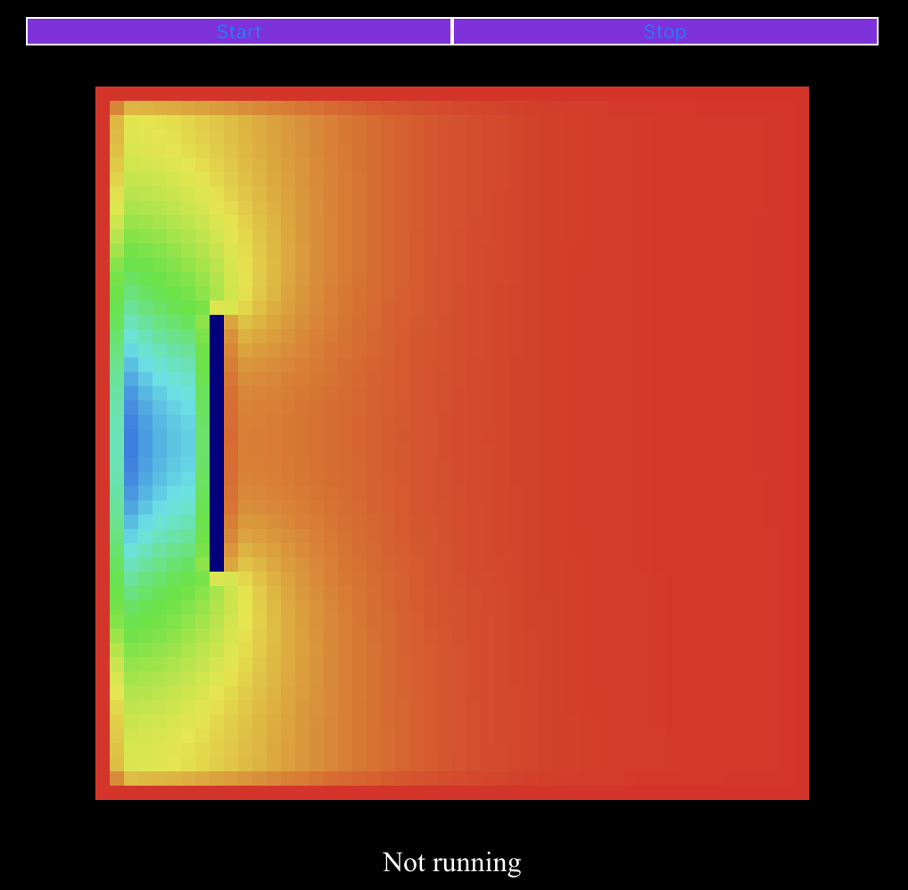

# Test de simulation de fluide 

> lien pour essayer : https://gantover.github.io/fluid_sim_test/

### Objectif
- experimenter avec **yew** : framework frontend en rust remplacant l'habituel javascript
- faire une ebauche de simulation de fluide et surtout, pouvoir la visualiser

### Hypotheses
- Fluide incompressible
- Viscosite nulle

### Etat actuel
- Simulation de la repartission de pression d'un fluide avec valeurs non realiste
- Une impulsion est donnee sur la moitie du mur gauche et on observe la repartission de pression
perturbee par un objet

### TODO
- Les bords ne fonctionnent pas bien
- Rendre la simulation realiste
    - Implementer de vraies valeurs de densite, etc
    - Implementer un vrai code couleur avec legende
- Pouvoir placer ses obstacles en appuyant sur les carres
- Pouvoir choisir l'impulsion initiale et son emplacement
- Pouvoir choisir les valeurs physiques caracterisant le fluide
- Ajouter la viscosite
- Ajouter la possibilite d'avoir de la gravite
- Optimisation de la memoire utilisee

### Ressources utilisees
- https://matthias-research.github.io/pages/tenMinutePhysics/17-fluidSim.pdf
- https://github.com/yewstack/yew/tree/master/examples/game_of_life
